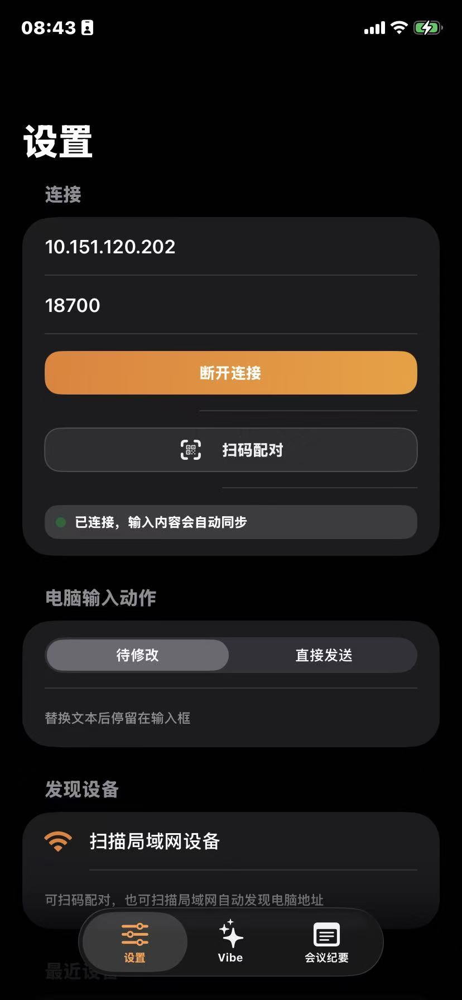
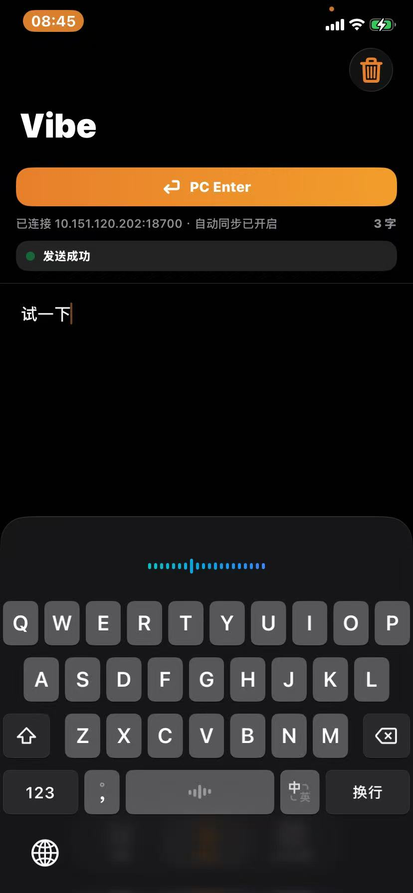

# say vibe iOS

`ios/` 是 `say vibe` 的 SwiftUI iPhone 客户端。

它的定位很直接：把 iPhone 系统输入法的语音输入当作采集层，再把文本稳定同步到 Mac。这样不需要额外做一套语音识别，也更容易跟着系统输入法获得不同语言和方言能力。

## 预览

<table>
  <tr>
    <td width="50%" align="center">
      
    </td>
    <td width="50%" align="center">
      
    </td>
  </tr>
  <tr>
    <td align="center"><strong>设置</strong></td>
    <td align="center"><strong>Vibe</strong></td>
  </tr>
</table>

<p align="center">
  
</p>

## 主要能力

- 三个主板块：`设置`、`Vibe`、`会议纪要`
- 连接检测：`GET /health`
- 文本同步：`POST /api/push_text`
- 局域网扫描、最近设备、扫码配对
- 输入自动防抖同步
- 远程切换电脑端自动输出动作
- 远程触发 `PC Enter`
- 会议纪要按文档保存，支持导出 `.txt`
- 中英文切换
- 主题切换：系统 / 浅色 / 深色
- 主屏 Widget 快速打开输入区

## 使用方式

1. 用完整 Xcode 打开 `ios/SayVibe.xcodeproj`
2. 在 `Signing & Capabilities` 里选择你自己的 Team
3. 运行到 iPhone 或模拟器
4. 在 `设置` 页通过扫码或手动地址连接桌面端
5. 连接成功后进入 `Vibe` 页开始同步输入

## 板块说明

### 设置

- 配置电脑 IP 和端口
- 扫描局域网设备
- 扫码配对
- 选择语言和主题
- 切换电脑端自动输出动作

### Vibe

- 输入内容会自动同步到桌面端
- 顶部可直接触发 `PC Enter`
- 适合“先语音，再在电脑端补改”的工作方式

### 会议纪要

- 以文档列表方式保存会议记录
- 支持搜索、继续编辑、导出
- 适合把临时输入沉淀成长期留存的内容

## 主屏小组件

1. 长按 iPhone 主屏空白处，点击右上角 `+`
2. 搜索 `say vibe`
3. 添加小组件后可快速打开输入页

## 打包 IPA

准备条件：

1. Xcode 已登录你的 Apple ID
2. 工程里已经选好 Team
3. iPhone 已开启开发者模式

执行：

```bash
./ios/scripts/package-iphone.sh
```

默认输出：

- `ios/build/package/export/*.ipa`

如果需要手动指定 Team：

```bash
TEAM_ID=ABCDE12345 ./ios/scripts/package-iphone.sh
```

## 更新图标

如果替换了共享 logo，可重新生成 iOS App Icon：

```bash
./ios/scripts/generate-appicon.sh
```

## 说明

- `Info.plist` 已包含本地网络和扫码所需权限说明。
- IPA 导出依赖你自己的签名证书和 Apple Team。
- 免费 Apple ID 通常只有短周期签名，需要重新安装。

## 维护信息

- Maintainer: `aqiangai`
- License: `MIT`
