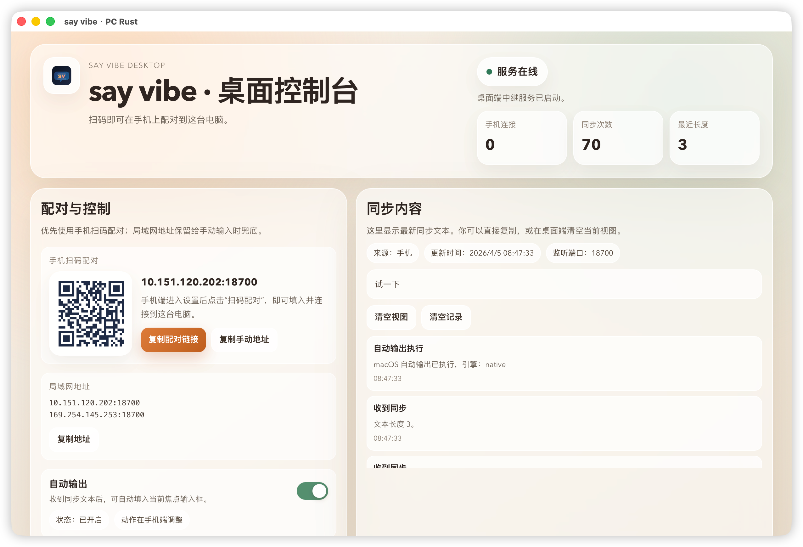

# say vibe desktop

`pc_rust/` 是 `say vibe` 的桌面端，技术栈为 `npm + Vue + Vite + Tauri + Rust`。

它负责两件事：

1. 在本机启动一个局域网 relay，让 iPhone 可以稳定连接到这台电脑。
2. 把同步过来的文本展示出来，并在需要时自动输出到当前焦点输入框。

## 预览

<p align="center">
  
</p>

## 主要能力

- 展示配对二维码和局域网地址
- 接收移动端同步文本
- 展示连接状态、同步次数、日志和最近文本
- 自动输出支持两种动作模式
  - `Review`：替换文本后停留在输入框，方便继续改
  - `Send`：替换文本后直接回车
- 提供单独的 `PC Enter` 控制接口
- 当前文本区默认不可复制，避免误触 `Command+A`

## 目录

- `src/`
  - Vue 桌面界面
- `src-tauri/src/`
  - Rust 宿主和 relay 逻辑
- `src-tauri/icons/`
  - 桌面图标资源

## 开发

安装依赖：

```bash
cd pc_rust
npm install
```

仅调前端：

```bash
cd pc_rust
npm run dev
```

联调桌面端：

```bash
cd pc_rust
npm run tauri:dev
```

默认 relay 端口是 `18700`。如需改端口：

```bash
cd pc_rust
PORT=18701 npm run tauri:dev
```

## 构建

```bash
cd pc_rust
npm run tauri:build
```

## Relay 接口

- `GET /health`
- `GET /api/state`
- `GET /events`
- `GET /dashboard`
- `GET /android`
- `POST /api/push_text`
- `POST /api/control/auto-ime`
- `POST /api/control/auto-ime-mode`
- `POST /api/control/pc-enter`

## macOS 权限说明

- 自动输出依赖辅助功能权限。
- 某些输出路径会使用 `System Events`，因此 build 版需要在系统设置里允许 `say vibe.app` 的相关控制权限。
- `tauri dev` 和正式 build 的授权对象不同，调试阶段通常是 `Terminal` 或 `iTerm`，正式版则是 `say vibe.app`。

## 维护信息

- Maintainer: `aqiangai`
- License: `MIT`
